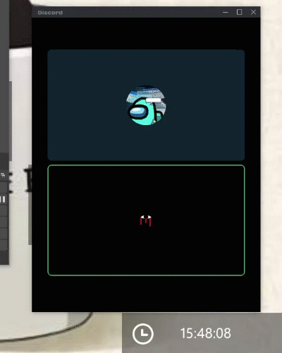

# FakeModernUIApplication.exe


Một phầm mềm máy tính viết dựa trên ngôn ngữ lập trình Python nhằm che lại cửa sổ của hệ điều hành Windows 10

# Hướng dẫn sử dụng
* Tải phần mềm tại đường link
``` 
https://github.com/nVietUK/FakeModernUIApplication/releases/download/v0.1/FakeDiscord.zip
```
* Giải nén file .zip
* Mở phần mềm lên lần đầu và nhấn ok
* Mở FakeDiscord.txt và chỉnh sửa theo ý muốn của bản thân
* Tiếp tục mở phần mềm và sử dụng
# Điều khoản sử dụng
Đây là phần mềm không trả phí và có thể tái sử dụng các lệnh
# Liên lạc
```bash
vietuk.nguyen.git@icloud.com
```